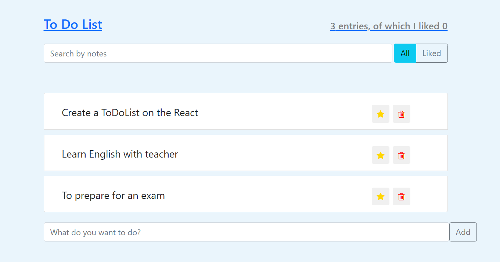

<div align="center">
	<br>
	<h1>Todo List</h1>
</div>

<!-- PROJECT SHIELDS -->
<div align="center">

   
   
   
   

</div>

<!-- ABOUT THE PROJECT -->
## About The Project



Todo List is a task management app whose main goal is to help users stay organized and manage their day-to-day tasks. A user has the ability to add, delete, filter a task by specific filters, and mark it as completed. Also, for convenience, there is a search field that allows a user to quickly find a desired task. With this app, a user can complete goals without wasting time trying to figure out priorities.

## Built With

* [React](https://reactjs.org/) 
* [Bootstrap](https://getbootstrap.com/)
* [Styled Components](https://styled-components.com/)
* [HTML](https://developer.mozilla.org/en-US/docs/Web/HTML/) 
* [CSS](https://developer.mozilla.org/en-US/docs/Web/CSS/) 

<!-- GETTING STARTED -->
## Getting Started

### Prerequisites

* [Git](https://git-scm.com)
* [Node.js](https://nodejs.org/en/download/)
* [npm](http://npmjs.com)

### Installation

```sh
# Step 1: Clone the repository
$ git clone https://github.com/RadyaBen/Todo-List.git

# Step 2: Go into the repository 
$ cd Todo-List

# Step 3: Install NPM packages
$ npm install

# Step 4: Run the app 
$ npm start
```